# 02. データフロー

主要な操作ごとに、どのコンポーネントがどの順番で何を読み書きするかを示す。構成要素と認証情報は [01-architecture.md](01-architecture.md)、
テーブルの詳細は [03-data-model.md](03-data-model.md)、API の仕様は [04-api.md](04-api.md)。キャラクターエンジンの処理（6〜11）は
返答の経路（API）・返答の後のジョブ（worker）・定期実行（worker のスケジューラ）に分かれる（[ADR-0035](../adr/0035-character-engine-architecture.md)・
[ADR-0036](../adr/0036-engine-job-queue-and-scheduler.md)）。

## 誰がどこに書くか（まとめ）

「API・worker」は Python API（`app` プロセス）と worker プロセス（返答の後のジョブ・定期実行）。どちらも `postgres` ロールで RLS をバイパスし、クエリを user_id でスコープする。

| テーブル              | クライアント（`authenticated`）                                 | API・worker（`postgres`）                                  | DB トリガー / その他                          |
| --------------------- | --------------------------------------------------------------- | ---------------------------------------------------------- | --------------------------------------------- |
| `profiles`            | 本人の行を参照、`display_name` / `deleted_at`（退会）を更新      | 退会済みかの確認（参照のみ）                               | `auth.users` 作成時に自動作成                 |
| `characters`          | 公開列だけ参照                                                  | ペルソナ・`system_prompt` を参照                           | シード / 運用者の SQL                         |
| `posts`               | 公開済みを参照                                                  | コメント時に公開済みかを確認。**予定からの投稿を作成**（`calendar.tick`、`source_event_id`） | シード / 運用者の SQL。`like_count` / `comment_count` はトリガー |
| `post_private_assets` | 不可                                                            | —（参照するコードは無い）                                  | シード / 運用者の SQL                         |
| `likes`               | 本人の行を参照・作成・削除                                      | —                                                          | —                                             |
| `comments`            | 参照、自分のコメントを削除                                      | ユーザーのコメント作成、キャラの返信作成                    | 削除を `audit_logs` に記録                    |
| `conversations`       | 本人の会話を参照、既読（RPC）                                    | 作成、`summary_cursor`・`analyzed_until` の更新            | `last_message_at` はトリガー                  |
| `messages`            | 本人の会話のものを参照（Realtime で購読）                        | ユーザー発言とキャラ返答を 1 トランザクションで保存（`safety_triggered`）、初回挨拶、**自発メッセージ**（`is_proactive`） | —                    |
| `memories`            | 本人の記憶を参照（`embedding` 以外。Realtime で INSERT を購読。UI の一覧は API） | 返答の後の分析・統合・置き換え・要約・メモリパネルの CRUD・参照の記録 | `updated_at` はトリガー（内容が変わったときだけ） |
| `memory_tombstones`   | 不可                                                            | メモリパネルの削除で作成、自動抽出で照合                    | —                                             |
| `promises`            | 本人の約束を参照                                                | 返答の後の分析で作成・状態の変更、ユーザーの完了・取り消し、自発メッセージで `mentioned` | `updated_at` はトリガー             |
| `character_memories`  | 不可                                                            | 返答の後の分析（キャラの発言）、`calendar.tick`（終わった予定） | —                                         |
| `character_events`    | 不可                                                            | `calendar.ensure_schedules`（生成）・`calendar.tick`（完了）・約束の予定化 | 重なりは排他制約で拒否                 |
| `character_states`    | 有効キャラの `status_label` / `busyness` / `updated_at` を参照    | `calendar.tick` で更新                                     | —                                             |
| `affinity_states` / `affinity_history` | 不可（A11）                                    | 返答の後の評価・日次の減衰・会話のたびの `last_interaction_at` | —                                          |
| `proactive_messages`  | 不可                                                            | `proactive.scan` で送信の記録、ユーザーの発言で `replied_at` | —                                           |
| `proactive_settings`  | 本人の設定を参照                                                | `PUT /proactive/settings` で作成・更新                      | `updated_at` はトリガー                       |
| `engine_jobs` / `engine_schedules` | 不可                                               | ジョブの登録（API）・実行（worker）/ 定期実行の記録         | —                                             |
| `post_image_pool`     | 不可                                                            | 投稿の画像を選ぶ（参照のみ）                               | シード（`seed_engine.sql`）/ 運用者の SQL     |
| `audit_logs`          | 不可                                                            | すべてのイベント（チャットとは別接続）                     | `comment.delete`                              |

## 1. ログイン

[ADR-0012](../adr/0012-pwa-and-login-magic-link-otp.md)・[ADR-0026](../adr/0026-magic-link-confirm-page.md)・[ADR-0033](../adr/0033-auth-hardening-password-otp-captcha.md)。リンクとコードのどちらでも完了し、
どちらでもログイン前に開こうとしていたページ（`next`）へ戻る。リンクとコードの有効期限は 15 分。

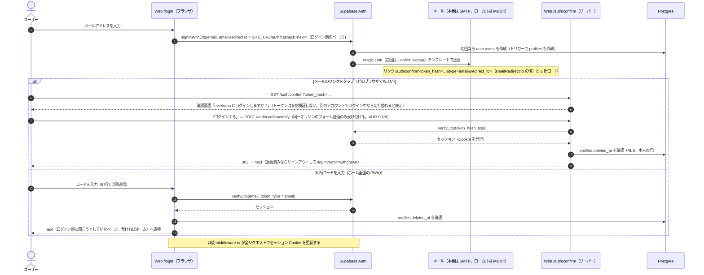

- コード入力待ちの状態（メールアドレスと送信時刻。コードは保存しない）は端末に 15 分保存する。メールアプリへ切り替えている間に iOS がホーム画面の
  PWA を再起動しても、コード入力画面から続けられる。送信間隔の制限（`over_email_send_rate_limit`）に当たった場合も、送信済みのコードの入力画面へ進む。
- 使用済み・期限切れのリンクは `/login?error=link&next=<元のページ>`。ログイン後に使えなくなったセッション（ユーザーの削除・利用停止）は、端末の
  セッションを消してから `/login?error=session` / `?error=banned` へ（`/` ⇄ `/login` のループにしない）。

## 2. フィードの表示

ページはクライアントコンポーネントで、データはブラウザから PostgREST へ直接取得する（Next.js のサーバーは関与しない）。

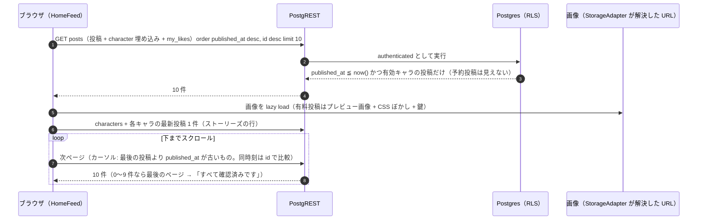

- カーソル方式なので、途中で予約投稿が公開されて先頭に増えてもページ境界で重複・欠落しない。
- 先頭で Home タブ・ロゴを再タップ、下に引っ張る、5 分以上バックグラウンドにいた後に先頭で復帰、のいずれかで 1 ページ目から取り直す
  （ホーム画面の PWA にはブラウザの再読み込みが無いため。[ADR-0031](../adr/0031-web-ui-accessibility-and-dev-only-pages.md)）。
- 有料投稿をタップするとロックモーダル（「購入する（準備中）」→ トースト）。本体画像はどこからも取得しない（[ADR-0006](../adr/0006-paid-post-private-assets.md)）。

## 3. いいね

テキストを含まないため、クライアントから Supabase へ直接書く（監査ログの対象外）。

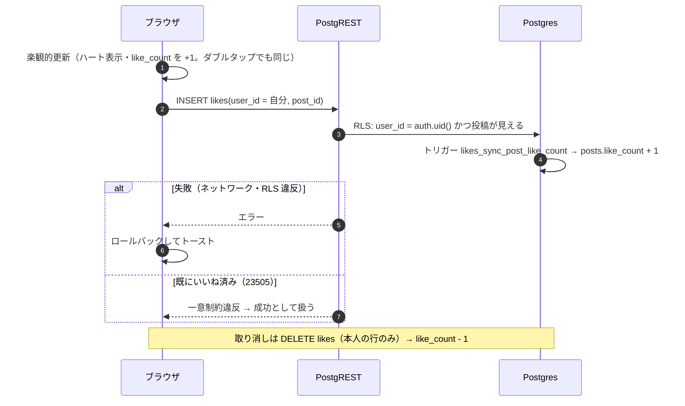

## 4. コメントとキャラの自動返信

[ADR-0014](../adr/0014-comments-via-api-and-auto-reply.md)。

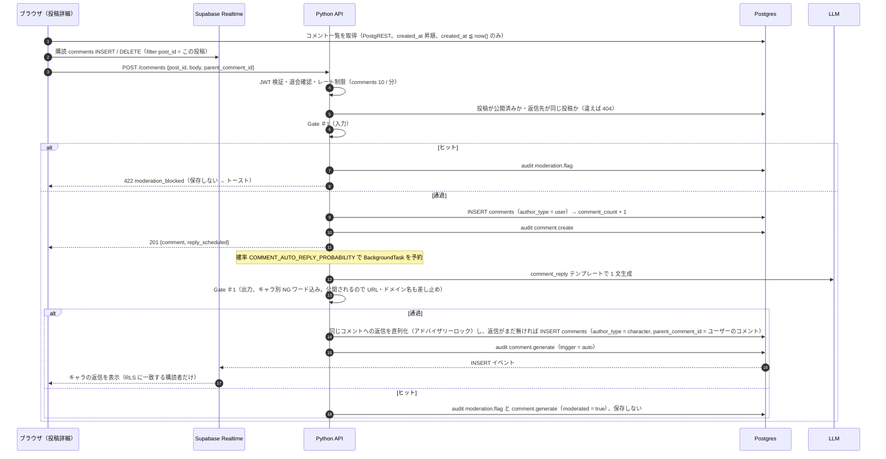

- 自分のコメントの削除はブラウザから直接 `DELETE comments`（RLS で本人のみ）。返信は cascade で消え、トリガーが `comment.delete` を記録する。
- キャラの返信はコメント 1 件につき 1 件まで。`POST /comments/generate`（Web の画面からは未使用）は自分のコメントだけに使え、既に返信があれば
  LLM を呼ばずにそれを返す（[ADR-0027](../adr/0027-comment-reply-generation-limits.md)）。
- 一覧は新しい方から 500 件を取り、昇順に並べる（それより古いコメントは表示しない旨を出す）。返信の @メンションは公開名（`user_xxxxxx` /
  キャラのハンドル）だけで、自分のコメントへの返信にはメンションを入れない（表示名・メールアドレスを公開しない）。

## 5. DM を開く

既存の会話は Python API を経由せずに開く（[ADR-0030](../adr/0030-web-data-fetching-dm-and-prefetch.md)）。API が止まっていても既存の会話の履歴は読める。

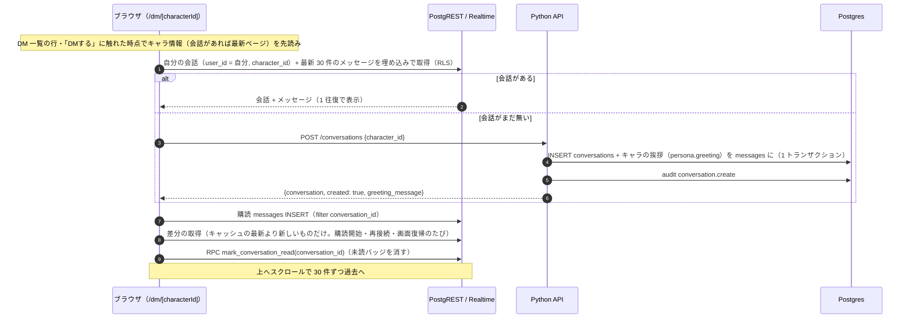

- DM ヘッダーの 2 行目（キャラの今の状況）は `character_states` の `status_label` / `busyness` を PostgREST で直接読む（有効なキャラだけ。DM の先読みで一緒に取り、
  画面を開いている間は 2 分ごと・画面への復帰時に取り直す。[ADR-0047](../adr/0047-web-engine-ui.md)）。キャラからの自発メッセージも通常のメッセージとして履歴に入る。
- DM 一覧（`/dm`）は RPC `list_dm_threads()`（最新メッセージ・未読数）と、**自分の会話に絞った** `messages` の INSERT の購読
  （`conversation_id=in.(...)`、最大 100 件）、30 秒ごとのポーリングで更新する。

## 6. DM を送る（`POST /chat/stream`・`POST /chat`）

[ADR-0037](../adr/0037-chat-streaming-sse.md)（ストリーミング）、[ADR-0043](../adr/0043-safety-e6-and-output-guard.md)（E6・出力の検査）、[ADR-0035](../adr/0035-character-engine-architecture.md)（文脈）、
[ADR-0019](../adr/0019-chat-deadline.md)（締め切り）、[ADR-0010](../adr/0010-gate1-moderation.md)（Gate #1）。番号は `apps/api/app/engine/pipeline.py` の冒頭コメントと同じ。
`/chat` は同じパイプラインを最後まで読み、`done` の内容を JSON で返す。

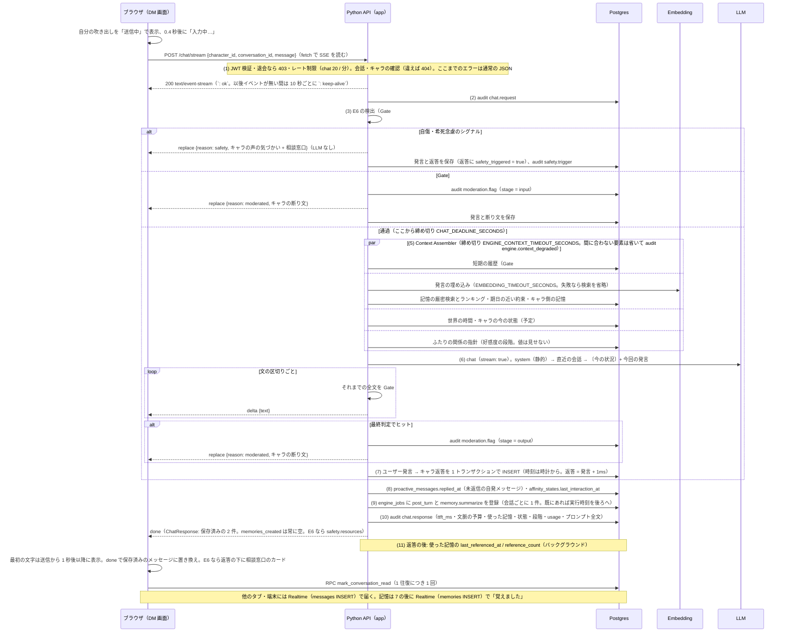

- **LLM の失敗（リトライ後）または締め切り超過**: `delta` を送った後でも `error`（503 `llm_unavailable`）を送り、**メッセージは何も保存しない**（`llm.error`）。
  画面では受信中の吹き出しを消し、自分の吹き出しが「送信できませんでした・タップで再送」になる。`/chat` は 503 を返す。
- クライアントが接続を切っても、生成・保存・ジョブの登録は最後まで行う（次に画面を開いたとき・Realtime で届く）。
- ストリーミングを使えない環境・`/chat/stream` の無い API では、Web は `POST /chat` にフォールバックする（[ADR-0047](../adr/0047-web-engine-ui.md)）。
- 端末がオフラインなら送信はすぐに失敗し、通信エラーのトーストが出る（[ADR-0029](../adr/0029-web-network-failure-policy.md)）。
- 返答待ちのまま画面を離れて戻っても、送った発言と受信中の返答は残り、同じタブからは二重に送れない（別のタブ・端末からの同時送信は防いでいない）。

## 7. 返答の後のジョブ（`post_turn`・`memory.summarize`）

worker のワーカーが処理する（[ADR-0036](../adr/0036-engine-job-queue-and-scheduler.md)・[ADR-0038](../adr/0038-memory-engine-v2.md)・[ADR-0041](../adr/0041-affinity-engine.md)）。
`post_turn` は返答から `ENGINE_POST_TURN_DELAY_SECONDS`（既定 180 秒）後に実行でき、続けて話すあいだは後ろにずれる（最大 18 分）。
**「覚えました」の通知と約束の登録は、ユーザーが話すのをやめてから約 3 分後（話し続ければ最大 18 分後）** になる。
通知はそのキャラの DM の画面を開いている間だけ出る（Realtime の購読は DM の画面。閉じた後に作られた記憶は、次にメモリパネルを開いたときに見える）。

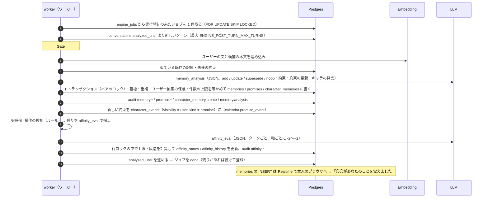

- 途中で失敗した場合は、終えた手順を記録して再試行する（指数バックオフ。上限 `ENGINE_JOB_MAX_ATTEMPTS` で `dead`、audit `engine.job_dead`）。最後の試行でも失敗した手順は飛ばす。
- `memory.summarize`: 未要約のメッセージが 100 件（`MEMORY_SUMMARY_TRIGGER_TURNS` × 2）を超えたら、古い順にチャンクで要約して `kind = summary` の記憶を作る（[ADR-0028](../adr/0028-llm-input-budgets-and-summary-retries.md)）。

## 8. メモリパネルでの編集と約束

DM 画面ヘッダーの「i」で開く。変更はすべて Python API 経由（Gate #1 + 監査ログ）（[ADR-0038](../adr/0038-memory-engine-v2.md)・[ADR-0039](../adr/0039-user-edited-memory-protection.md)）。

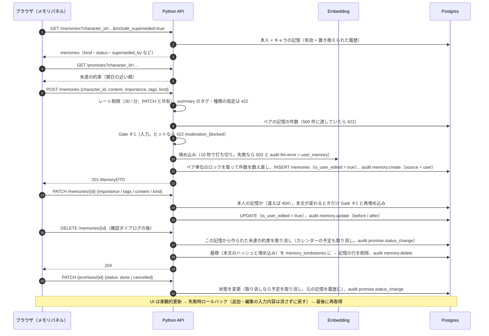

- 削除した記憶は次の返答の検索対象から外れ、**自動抽出でも作り直されない**（墓標。ユーザーが追加し直すのは可）。ユーザーが追加・編集した記憶は自動処理で上書き・置き換えされない（E5）。
- `secret` タグ（「二人だけの秘密」）の記憶は、プロンプトで `（二人だけの秘密）` を付けて渡る。

## 9. キャラの予定と状態（`calendar.ensure_schedules`・`calendar.tick`）

worker のスケジューラ（リーダーの 1 台）が動かす（[ADR-0040](../adr/0040-character-calendar.md)）。LLM を使うのはフィードのキャプションだけ。

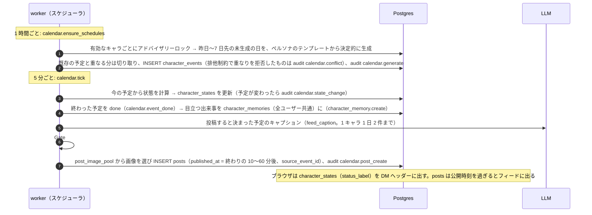

## 10. 自発メッセージ（`proactive.scan`）

10 分ごと（[ADR-0042](../adr/0042-proactive-messenger.md)）。

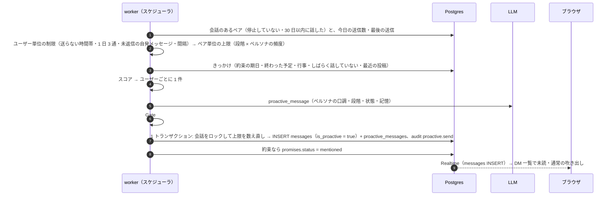

## 11. 日次の処理（`affinity.daily`・`jobs.cleanup`）

| タスク | 時刻（JST） | 内容 |
| --- | --- | --- |
| `affinity.daily` | 毎日 4 時（`ENGINE_AFFINITY_DAILY_HOUR_JST`） | 気まずさ・不満・独占欲の減衰（audit `affinity.decay`）、日数の経過による段階の遷移（`affinity.stage_change`）。好意の軸は減らさない |
| `jobs.cleanup` | 毎日 3 時 | `running` のまま止まったジョブを戻す（上限なら `dead`）、完了から `ENGINE_JOB_RETENTION_DAYS` たったジョブを削除 |

## 12. 退会

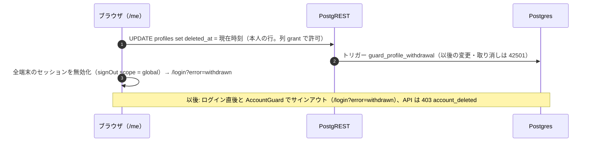

データ（会話・記憶）は削除されない。復旧・物理削除は運用者が行う（[06-operations.md](06-operations.md#定常作業)）。
