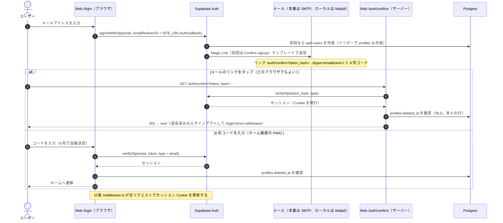
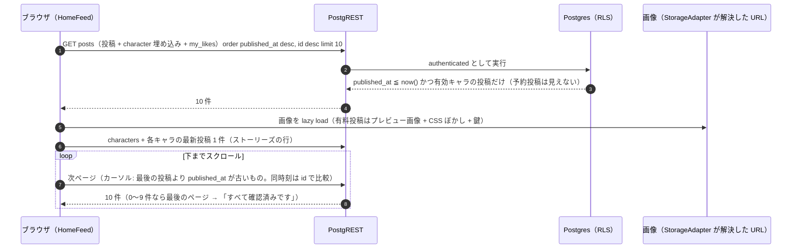
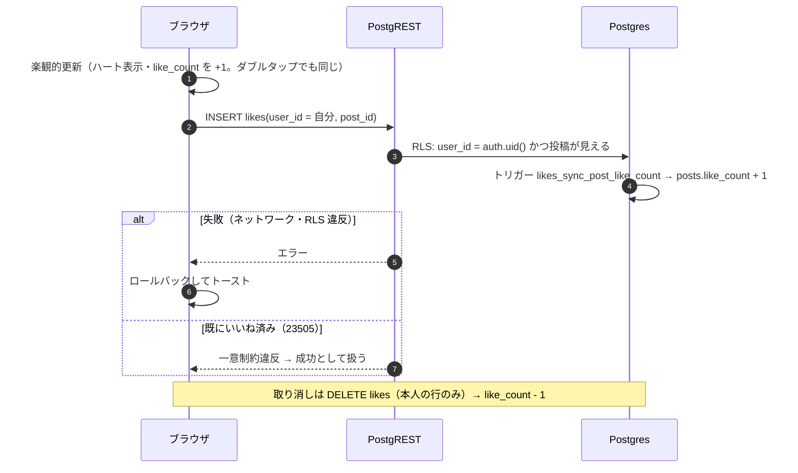
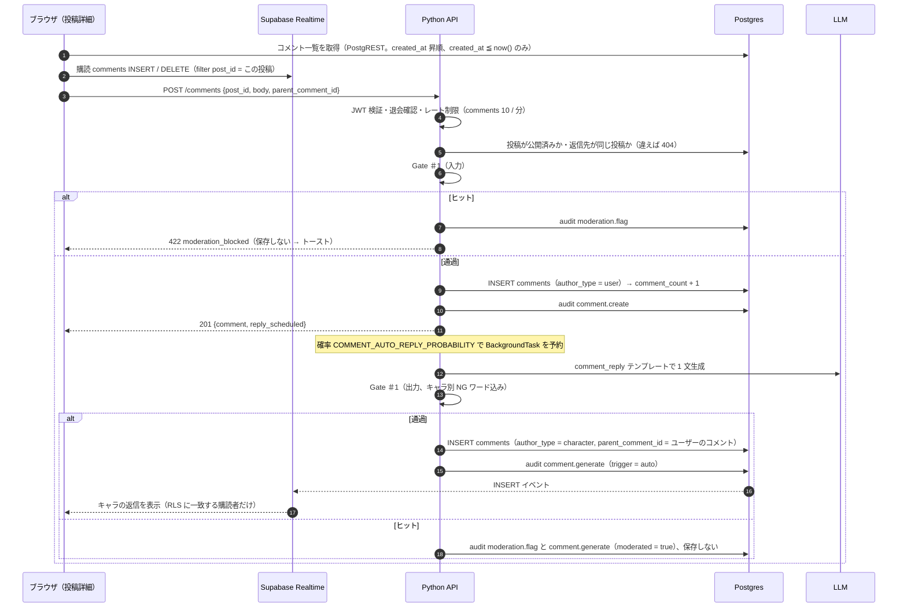
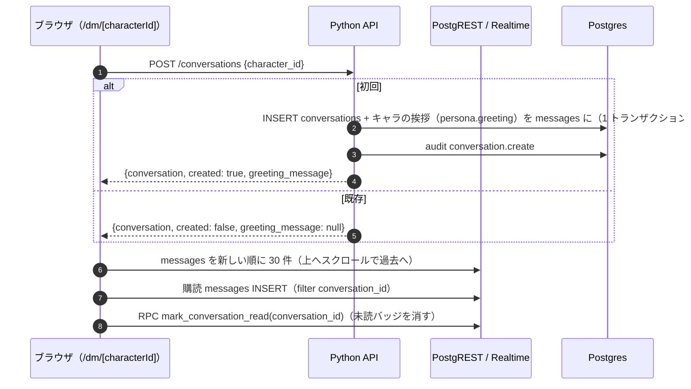
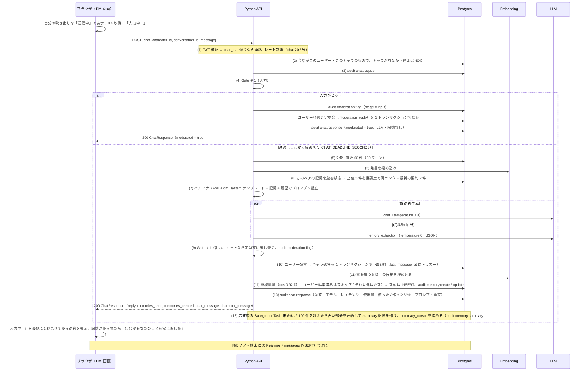
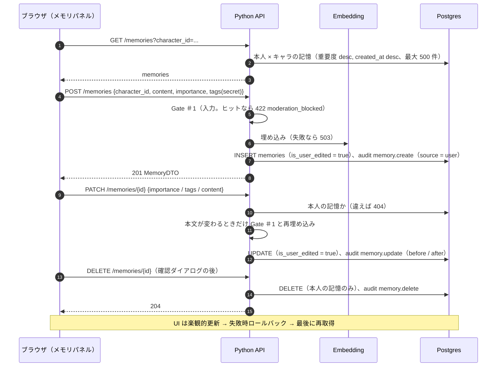
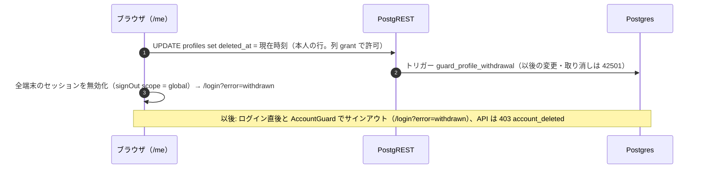

# 02. データフロー

主要な操作ごとに、どのコンポーネントがどの順番で何を読み書きするかを示す。構成要素と認証情報は [01-architecture.md](01-architecture.md)、
テーブルの詳細は [03-data-model.md](03-data-model.md)、API の仕様は [04-api.md](04-api.md)。

## 誰がどこに書くか（まとめ）

| テーブル              | クライアント（`authenticated`）                                 | Python API（`postgres`）                                   | DB トリガー / その他                          |
| --------------------- | --------------------------------------------------------------- | ---------------------------------------------------------- | --------------------------------------------- |
| `profiles`            | 本人の行を参照、`display_name` / `deleted_at`（退会）を更新      | 退会済みかの確認（参照のみ）                               | `auth.users` 作成時に自動作成                 |
| `characters`          | 公開列だけ参照                                                  | ペルソナ・`system_prompt` を参照                           | シード / 運用者の SQL                         |
| `posts`               | 公開済みを参照                                                  | コメント時に公開済みかを確認                               | シード / 運用者の SQL。`like_count` / `comment_count` はトリガー |
| `post_private_assets` | 不可                                                            | —（参照するコードは無い）                                  | シード / 運用者の SQL                         |
| `likes`               | 本人の行を参照・作成・削除                                      | —                                                          | —                                             |
| `comments`            | 参照、自分のコメントを削除                                      | ユーザーのコメント作成、キャラの返信作成                    | 削除を `audit_logs` に記録                    |
| `conversations`       | 本人の会話を参照、既読（RPC）                                    | 作成、`summary_cursor` の更新                              | `last_message_at` はトリガー                  |
| `messages`            | 本人の会話のものを参照（Realtime で購読）                        | ユーザー発言とキャラ返答を 1 トランザクションで保存、初回挨拶 | —                                           |
| `memories`            | 本人の記憶を参照（`embedding` 以外。UI は API の一覧を使う）      | 抽出・重複排除・要約・メモリパネルの CRUD                  | `updated_at` はトリガー                       |
| `audit_logs`          | 不可                                                            | すべてのイベント（チャットとは別接続）                     | `comment.delete`                              |

## 1. ログイン

[ADR-0012](../adr/0012-pwa-and-login-magic-link-otp.md)。リンクとコードのどちらでも完了する。

## 2. フィードの表示

ページはクライアントコンポーネントで、データはブラウザから PostgREST へ直接取得する（Next.js のサーバーは関与しない）。

- カーソル方式なので、途中で予約投稿が公開されて先頭に増えてもページ境界で重複・欠落しない。
- 有料投稿をタップするとロックモーダル（「購入する（準備中）」→ トースト）。本体画像はどこからも取得しない（[ADR-0006](../adr/0006-paid-post-private-assets.md)）。

## 3. いいね

テキストを含まないため、クライアントから Supabase へ直接書く（監査ログの対象外）。

## 4. コメントとキャラの自動返信

[ADR-0014](../adr/0014-comments-via-api-and-auto-reply.md)。

- 自分のコメントの削除はブラウザから直接 `DELETE comments`（RLS で本人のみ）。返信は cascade で消え、トリガーが `comment.delete` を記録する。

## 5. DM を開く

- DM 一覧（`/dm`）は RPC `list_dm_threads()`（最新メッセージ・未読数）と、`messages` の INSERT の購読で更新する。

## 6. DM を送る（`POST /chat`、13 ステップ）

[ADR-0009](../adr/0009-memory-engine.md)（メモリ）、[ADR-0010](../adr/0010-gate1-moderation.md)（Gate #1）、[ADR-0019](../adr/0019-chat-deadline.md)（締め切り）。
番号は `apps/api/app/services/chat.py` の冒頭コメントと同じ。

- **LLM の失敗（リトライ後）または締め切り超過**: audit `llm.error` を記録して **503 `llm_unavailable`**。メッセージは何も保存しない。
  画面では自分の吹き出しが「送信失敗」になり、タップで再送できる。
- 記憶の抽出が締め切りに間に合わない / 失敗した場合はチャットを成功させ、`llm.error`（`purpose = memory_extraction`）を記録する。

## 7. メモリパネルでの編集

DM 画面ヘッダーの「i」で開く。すべて Python API 経由（Gate #1 + 監査ログ）。

- 削除した記憶は次の `/chat` の検索対象から外れる（`memories_used` に出ない）。ユーザーが追加・編集した記憶は自動抽出の重複排除で上書きされない。
- `secret` タグ（「二人だけの秘密」）の記憶は、プロンプトで `（二人だけの秘密）` を付けて渡る。

## 8. 退会

データ（会話・記憶）は削除されない。復旧・物理削除は運用者が行う（[06-operations.md](06-operations.md#定常作業)）。
