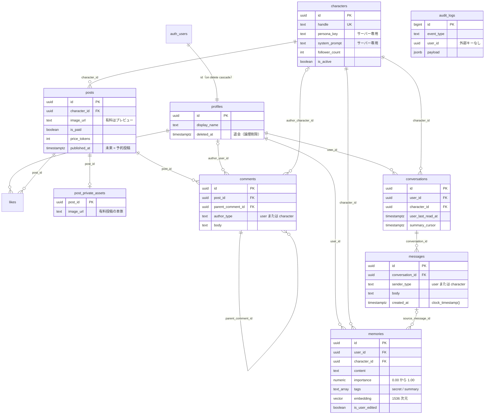

# 03. データモデル

正は `infra/supabase/migrations/`。MVP の `20260925000000_init.sql` と、キャラクターエンジン v1.0 の次のマイグレーション（エンジン仕様書 §8）:

| マイグレーション | 内容 |
| --- | --- |
| `20260926000000_character_engine.sql` | エンジンのテーブル一式・`messages` / `conversations` / `memories` / `posts` の列の追加・RLS と grant・`memories` の Realtime |
| `20260926100000_memory.sql` | `memories` / `promises` の `updated_at` のトリガー（内容が変わったときだけ。アプリの時計の値を尊重）・墓標の索引 |
| `20260926110000_calendar.sql` | `calendar.tick` の問い合わせ用の部分索引 |
| `20260926120000_affinity.sql` | `affinity_states` の段階のヒステリシス・減衰・久しぶりの会話の列 |
| `20260926140000_safety_flag.sql` | `messages.safety_triggered`（E6） |
| `20260926140100_proactive_quiet_pair.sql` | 送らない時間帯は「両方 null か両方が値」の制約 |

Web 用の型は `packages/shared/src/database.types.ts`（`pnpm db:types` で生成、CI でずれを検出）。仕様書 §6 との差分と理由は [ADR-0004](../adr/0004-schema-changes-from-spec.md)、
エンジンのテーブルの設計は [ADR-0035](../adr/0035-character-engine-architecture.md)〜[ADR-0042](../adr/0042-proactive-messenger.md)。

## ER 図



### キャラクターエンジンの ER 図

```mermaid
erDiagram
  profiles ||--o{ memories : "user_id"
  memories |o--o{ memories : "superseded_by"
  conversations |o--o{ memories : "source_conversation_id"
  profiles ||--o{ memory_tombstones : "user_id"
  characters ||--o{ memory_tombstones : "character_id"
  profiles ||--o{ promises : "user_id"
  characters ||--o{ promises : "character_id"
  memories |o--o{ promises : "source_memory_id"
  character_events |o--o{ promises : "event_id"
  characters ||--o{ character_events : "character_id"
  profiles |o--o{ character_events : "user_id（約束の予定）"
  character_events |o--o| posts : "post_id / posts.source_event_id"
  characters ||--o| character_states : "character_id"
  characters ||--o{ character_memories : "character_id"
  profiles |o--o{ character_memories : "user_id（null = 共通）"
  character_events |o--o{ character_memories : "source_event_id"
  profiles ||--o{ affinity_states : "user_id"
  characters ||--o{ affinity_states : "character_id"
  profiles ||--o{ affinity_history : "user_id"
  conversations ||--o{ proactive_messages : "conversation_id"
  messages |o--o| proactive_messages : "message_id"
  profiles ||--o{ proactive_settings : "user_id"
  characters |o--o{ proactive_settings : "character_id（null = 全体）"
  characters |o--o{ post_image_pool : "character_id（null = 共通）"

  memories {
    text kind "fact / preference / episode / promise / emotion / relationship / summary"
    text status "active / superseded"
    timestamptz last_referenced_at
    int reference_count
  }
  promises {
    timestamptz due_at
    text due_precision
    text status "pending / mentioned / done / cancelled"
  }
  character_events {
    text kind "routine / oneoff / seasonal / promise"
    text visibility "public / user"
    timestamptz starts_at "公開の予定は重ならない（排他制約）"
    timestamptz ends_at
  }
  affinity_states {
    numeric closeness
    numeric trust
    numeric romance
    numeric awkwardness
    numeric discontent
    numeric possessiveness
    text stage "acquaintance / friend / close / lover"
  }
  engine_jobs {
    bigint id PK
    text kind
    text dedupe_key
    text status "queued / running / done / failed / dead"
  }
```



`affinity_*` は課金・有料投稿のテーブル（`posts`・`post_private_assets`・`likes`、将来の課金テーブル）への外部キー・結合を持たない（E1。
`apps/api/tests/engine/affinity/test_e1_structure.py` で検査）。`engine_jobs`・`engine_schedules` はどのテーブルとも外部キーを持たない。

## テーブル

`[追加]` は仕様書 §6 に無いもの。`created_at` は全テーブルにあり、既定値は `now()`（`messages` だけ `clock_timestamp()`）。

### profiles — ユーザー（`auth.users` の拡張）

| 列             | 型          | 説明                                                                              |
| -------------- | ----------- | --------------------------------------------------------------------------------- |
| `id`           | uuid PK     | `auth.users.id`（`on delete cascade`）                                            |
| `display_name` | text        | 初期値はメールアドレスの `@` より前（30 文字に切り詰め）。`/me` で変更可。**check: NULL または 1〜30 文字**（コードポイント数。クライアントが直接 UPDATE できるため DB でも制限） |
| `deleted_at`   | timestamptz | 退会日時（論理削除）。非 NULL なら退会済み。本人は設定のみ可・取り消し不可         |

### characters — AI キャラクター

| 列                       | 型          | 説明                                                                           |
| ------------------------ | ----------- | ------------------------------------------------------------------------------ |
| `id`                     | uuid PK     | シードは固定 UUID `00000000-0000-4000-8000-0000000000c1`〜`…c10`               |
| `handle`                 | text UK     | `^[a-z0-9_.]{2,30}$`。URL `/c/[handle]`                                        |
| `name` / `avatar_url` / `bio` | text   | 表示名 / 絶対 URL またはオブジェクトキー / 自己紹介                             |
| `persona_key`            | text        | `packages/personas/<persona_key>.yaml`。**クライアント非公開**                  |
| `system_prompt`          | text        | YAML が読めない場合のフォールバック。**クライアント非公開**                    |
| `follower_count` [追加]  | int         | 表示専用の静的値（フォロー機能は無い）                                          |
| `is_active`              | boolean     | false でキャラ・投稿・コメントが見えなくなる（削除の代わりに使う）              |

### posts — キャラの投稿（ユーザーは投稿できない。H2）

| 列                                  | 型          | 説明                                                                                   |
| ----------------------------------- | ----------- | -------------------------------------------------------------------------------------- |
| `character_id`                      | uuid FK     | `characters`（cascade）                                                                |
| `image_url`                         | text        | 無料は本体、有料は **プレビュー**（本体とは推測できない別キー）                         |
| `caption`                           | text        |                                                                                        |
| `is_paid` / `price_tokens`          | boolean / int | 有料なら `price_tokens > 0`（check）                                                 |
| `like_count` / `comment_count`      | int         | トリガーで ±1（クライアントは直接更新できない）                                          |
| `published_at`                      | timestamptz | 公開日時。**未来なら RLS で公開時刻まで不可視（予約投稿）**                            |
| `source_event_id` [エンジン]        | uuid FK     | この投稿を作ったキャラの予定（`character_events`、`set null`。C7）                     |

索引: `(published_at desc)`、`(character_id, is_paid)`、`(source_event_id) where not null`。

### post_private_assets [追加] — 有料投稿の本体

`post_id`（PK / FK cascade）、`image_url`。RLS 有効・ポリシー無し・grant 無し = クライアントから到達不能（[ADR-0006](../adr/0006-paid-post-private-assets.md)）。

### likes

`(user_id, post_id)` PK。索引 `(post_id)`。

### comments — ユーザー or キャラのコメント

| 列                              | 型      | 説明                                                                                      |
| ------------------------------- | ------- | ----------------------------------------------------------------------------------------- |
| `post_id`                       | uuid FK | `posts`（cascade）                                                                        |
| `parent_comment_id` [追加]      | uuid FK | 返信先（`comments`、cascade）                                                             |
| `author_type`                   | text    | `user` / `character`                                                                      |
| `author_user_id` / `author_character_id` | uuid FK | どちらか一方だけ非 NULL（check）。`on delete set null` との矛盾は [ADR-0004](../adr/0004-schema-changes-from-spec.md) |
| `body`                          | text    | 1〜1000 文字（API は 500 文字まで）                                                        |

索引: `(post_id, created_at)`、`(parent_comment_id)`、`(author_user_id) where author_user_id is not null`（ユーザーの物理削除で使う）。

### conversations — DM の会話（ユーザー × キャラで 1 件）

| 列                          | 型          | 説明                                                                    |
| --------------------------- | ----------- | ----------------------------------------------------------------------- |
| `user_id` / `character_id`  | uuid FK     | `unique (user_id, character_id)`                                        |
| `last_message_at`           | timestamptz | `messages` の INSERT でトリガーが更新                                    |
| `user_last_read_at` [追加]  | timestamptz | これより新しいキャラ発言が未読。RPC `mark_conversation_read` で更新     |
| `summary_cursor` [追加]     | timestamptz | 中期要約の処理済み位置（この時刻以前は要約済み）                        |
| `analyzed_until` [エンジン] | timestamptz | 返答の後のジョブ（記憶・約束・好感度）で処理済みのメッセージの最新の `created_at` |

索引: `(user_id, last_message_at desc)`。

### messages — DM のメッセージ

`conversation_id`（FK cascade）、`sender_type`（`user` / `character`）、`body`（1〜4000 文字。API は 2000 文字まで）、
`created_at`（既定は `clock_timestamp()`。エンジンのパイプラインは時計の値を明示的に書き、同じ会話の直前のメッセージより必ず後にする）。索引 `(conversation_id, created_at)`。
[エンジン] `is_proactive`（キャラからの自発メッセージ）、`safety_triggered`（E6 の安全対応をしたキャラの返答。キャラの発言だけに付けられる check 制約）。

### memories — 長期メモリ

| 列                        | 型                          | 説明                                                                                  |
| ------------------------- | --------------------------- | ------------------------------------------------------------------------------------- |
| `user_id` / `character_id` | uuid FK                    | 誰の・どのキャラとの記憶か                                                             |
| `content`                 | text                        | 1〜1000 文字（API は 500 文字まで）                                                     |
| `importance`              | numeric(3,2)                | 0.00〜1.00。検索結果の再ランクに使う                                                    |
| `tags`                    | text[]                      | `secret`（二人だけの秘密）/ `summary`（中期要約。利用者は新たに付けられない）           |
| `embedding`               | extensions.vector(1536)     | **クライアント非公開**。HNSW 索引（DM 応答では使わない。[ADR-0005](../adr/0005-vector-index-and-exact-memory-search.md)） |
| `source_message_id`       | uuid FK                     | 抽出元のユーザー発言（`set null`）                                                      |
| `is_user_edited`          | boolean                     | true = ユーザーが追加・編集した記憶。自動処理で上書き・置き換えしない（E5）             |
| `updated_at` [追加]       | timestamptz                 | 内容が変わったときだけトリガーで更新（参照の記録・再埋め込みでは変えない。アプリが値を渡せばそれを使う） |
| `kind` [エンジン]         | text                        | `fact` / `preference` / `episode` / `promise` / `emotion` / `relationship` / `summary`（M2） |
| `status` [エンジン]       | text                        | `active` / `superseded`（矛盾で置き換えられた履歴。M4）。`superseded_at` と整合（check） |
| `superseded_by` / `superseded_at` [エンジン] | uuid FK / timestamptz | 置き換えた新しい記憶（`memories`、`set null`）と日時                   |
| `last_referenced_at` / `reference_count` [エンジン] | timestamptz / int | 最後にプロンプトへ入れた日時と回数（検索の新しさ）                   |
| `source_conversation_id` [エンジン] | uuid FK             | 元の会話（`set null`）                                                                  |

索引: `(user_id, character_id, created_at desc)`、`(user_id, character_id, kind) where status = 'active'`、`(superseded_by)`・`(source_conversation_id)`（not null のみ）、
`(source_message_id) where source_message_id is not null`（メッセージ削除時の `set null` 用。
無いとユーザーの物理削除でメッセージ 1 件ごとに `memories` 全体を走査する）、HNSW `(embedding vector_cosine_ops)`。
ペアあたりの件数の上限は API が守る（`MEMORY_MAX_PER_CHARACTER`、[ADR-0024](../adr/0024-memory-capacity-per-pair.md)）。

### memory_tombstones [エンジン] — 削除した記憶の墓標（E5）

`user_id` / `character_id`（FK cascade）、`kind`、`content_hash`（正規化した本文の SHA-256）、`embedding`（vector(1536)）、`deleted_at`。**本文は持たない**。
自動抽出が同じ・よく似た記憶を作り直さないための照合に使う（[ADR-0039](../adr/0039-user-edited-memory-protection.md)）。索引 `(user_id, character_id, content_hash)`、`(character_id)`。

### promises [エンジン] — 約束（M6 / C8）

| 列 | 型 | 説明 |
| --- | --- | --- |
| `user_id` / `character_id` | uuid FK | cascade |
| `content` | text | 1〜500 文字 |
| `due_at` / `due_precision` | timestamptz / text | 期日（日付だけなら JST のその日の 12:00）と精度（`datetime` / `day` / `week` / `month` / `unknown`） |
| `status` | text | `pending` / `mentioned`（キャラが話題にした）/ `done` / `cancelled` |
| `source_memory_id` / `source_message_id` / `event_id` | uuid FK | 元の記憶・発言、カレンダーの予定（すべて `set null`） |
| `mentioned_at` / `completed_at` / `cancelled_at` / `updated_at` | timestamptz | 状態の変化の日時（`updated_at` はトリガー。アプリの値を尊重） |

索引: `(user_id, character_id, status, due_at)`、`(due_at) where status in ('pending', 'mentioned')` ほか外部キーの索引。

### character_events [エンジン] — キャラの予定（C2〜C4・C8・C10・C11）

| 列 | 型 | 説明 |
| --- | --- | --- |
| `character_id` | uuid FK | cascade |
| `kind` | text | `routine` / `oneoff` / `seasonal` / `promise` |
| `title` / `description` / `location` / `mood` | text | 予定の内容（長さの check あり） |
| `starts_at` / `ends_at` | timestamptz | `ends_at > starts_at` |
| `busyness` | smallint | 0 ひま〜3 手が離せない（睡眠など） |
| `visibility` / `user_id` | text / uuid FK | `public`（キャラの実際の生活）/ `user`（特定のユーザーとの約束。このときだけ `user_id`） |
| `participants` | uuid[] | 一緒に過ごすキャラ（C10。構造のみ） |
| `status` | text | `scheduled` / `done` / `cancelled` |
| `source` / `source_key` / `generated_for` | text / text / date | 生成元（`generator` / `seasonal` / `promise` / `manual`）・テンプレートのキー・生成単位の日付（JST。冪等） |
| `post_id` | uuid FK | この予定から作った投稿（`set null`） |
| `meta` | jsonb | 画像タグ・投稿の状態など |

**排他制約 `character_events_no_overlap`**（`btree_gist`）: 同じキャラの公開の予定（`visibility = 'public'` かつ `status <> 'cancelled'`）は時間が重ならない（C11）。
索引: `(character_id, starts_at)`、`(character_id, generated_for)`、`(user_id, starts_at)`、`calendar.tick` 用の部分索引 2 つ ほか。

### character_states [エンジン] — キャラの今の状態（C5）

`character_id`（PK / FK cascade）、`activity`・`location`・`mood`、`busyness`（0〜3）、`event_id`（今の予定、`set null`）、`status_label`（UI 用。40 文字まで）、`updated_at`。
`calendar.tick` が 5 分ごとに更新するキャッシュ。シードしない（最初の tick で作られる）。

### character_memories [エンジン] — キャラ側の記憶（M8 / C9）

`character_id`（FK cascade）、`user_id`（そのユーザーに話したこと。**null = 全ユーザー共通**の予定由来の出来事）、`kind`（`self_statement` / `event` / `fact`）、
`content`（1〜1000 文字）、`occurred_at`、`source_event_id` / `source_message_id`（`set null`）、`embedding`（vector(1536)）。

### affinity_states / affinity_history [エンジン] — 好感度（§6。クライアント非公開 = A11）

- `affinity_states`（PK `(user_id, character_id)`）: 軸 `closeness`（既定 10）・`trust`（10）・`romance`・`awkwardness`・`discontent`・`possessiveness`（0。すべて 0〜100 の numeric(5,2)）、
  `stage`（`acquaintance` / `friend` / `close` / `lover`）と `stage_changed_at`、昇格の候補（`stage_candidate`・`stage_candidate_since`・`stage_candidate_turns`）、
  `tension_high_since`、`last_interaction_at`、1 日の上限の集計（`daily_date`・`daily_delta`）、`evaluated_until`、`user_turns`、`last_decayed_at`、
  久しぶりの会話（`absence_days`・`absence_return_at`）、`updated_at`（トリガー）。日次処理用の部分索引。
- `affinity_history`（bigserial）: 変化の前後（`before` / `after` / `delta` jsonb）、`stage_before` / `stage_after`、`reason`（評価の要約）、`evaluator`（`llm:<model>` / `rule` / `decay` など）、
  `manipulation_detected`、`source_message_ids`。

### proactive_messages / proactive_settings [エンジン] — 自発メッセージ（§7）

- `proactive_messages`: `user_id` / `character_id` / `conversation_id`（cascade）、`message_id`（送ったメッセージ。差し止めたきっかけの記録は null）、`trigger`（`calendar_event` / `promise_due` /
  `seasonal` / `inactivity` / `feed_post` / `paid_notice`）、`trigger_ref`、`sent_at`、`replied_at`（P4）、`meta`。**一意 `(user_id, character_id, trigger, trigger_ref)`**（冪等）。
- `proactive_settings`: `user_id`、`character_id`（**null = 全体の設定**。`unique nulls not distinct (user_id, character_id)`）、`enabled`、`quiet_start` / `quiet_end`（JST の時 0〜23）、`updated_at`（トリガー）。
  check: 送らない時間帯は **両方 null（サーバーの既定に従う）か両方が値**（`proactive_settings_quiet_pair`）、キャラ別の行は時間帯を持たない（`proactive_settings_quiet_global_only`）。

### engine_jobs / engine_schedules [エンジン] — 非同期ジョブと定期実行（[ADR-0036](../adr/0036-engine-job-queue-and-scheduler.md)）

- `engine_jobs`（bigserial）: `kind`、`dedupe_key`、`payload`、`run_at`、`status`（`queued` / `running` / `done` / `failed` / `dead`）、`attempts` / `max_attempts`、`last_error`、
  `locked_at` / `locked_by`、`finished_at`、`updated_at`（トリガー）。**部分一意索引 `(kind, dedupe_key) where status in ('queued', 'running')`**（未処理は 1 件だけ）、
  `(run_at) where status = 'queued'`、`(status, finished_at)`。
- `engine_schedules`: `name`（PK。名前空間の接頭辞付き）、`last_run_at`、`next_run_at`、`last_error`、`updated_at`。

### post_image_pool [エンジン] — 予定からの投稿の画像（C7）

`character_id`（null = 全キャラ共通）、`tags`（text[]。GIN 索引。語彙は `app/engine/types.py` の `TAG_VOCABULARY`）、`image_url`（StorageAdapter で解決する URL / キー）。

### audit_logs — 監査ログ（H6）

`id` bigserial、`event_type`、`user_id`、`character_id`（外部キー無し。ユーザー削除後も残る）、`payload` jsonb、`created_at`。
索引 `(event_type, created_at desc)`、`(user_id, created_at desc)`。イベント種別と payload は [ADR-0013](../adr/0013-audit-log.md)。

## 権限マトリクス（ロール別）

`public` スキーマは `revoke all` の後、必要なものだけを明示的に grant している（今後作るテーブル・関数も既定で非公開）。
**全テーブルで RLS 有効**。ポリシーはすべて `to authenticated`。

| テーブル / 関数            | anon                                  | authenticated（ブラウザ）                                                                                   | postgres（Python API・SQL Editor） | service_role |
| -------------------------- | ------------------------------------- | ----------------------------------------------------------------------------------------------------------- | ---------------------------------- | ------------ |
| `profiles`                 | —                                     | SELECT（本人）、UPDATE `display_name` / `deleted_at`（本人。退会の取り消しはトリガーで拒否）                 | すべて（RLS バイパス）             | すべて       |
| `characters`               | —                                     | SELECT 公開列のみ（`id, handle, name, avatar_url, bio, follower_count, is_active, created_at`）、`is_active` の行 | すべて                          | すべて       |
| `posts`                    | —                                     | SELECT（`published_at <= now()` かつ有効キャラ）                                                            | すべて                             | すべて       |
| `post_private_assets`      | —                                     | —                                                                                                           | すべて                             | すべて       |
| `likes`                    | —                                     | SELECT / INSERT / DELETE（本人の行。INSERT は見える投稿のみ）                                               | すべて                             | すべて       |
| `comments`                 | SELECT `id` のみ（ポリシー無し = 0 行。Realtime 用。[ADR-0016](../adr/0016-realtime-anon-primary-key-grant.md)） | SELECT（見える投稿かつ `created_at <= now()`）、DELETE（本人の user コメント）   | すべて                             | すべて       |
| `conversations`            | —                                     | SELECT（本人）、UPDATE `user_last_read_at`（本人）                                                          | すべて                             | すべて       |
| `messages`                 | SELECT `id` のみ（0 行。Realtime 用） | SELECT（本人の会話）                                                                                        | すべて                             | すべて       |
| `memories`                 | SELECT `id` のみ（0 行。Realtime 用。エンジンで追加） | SELECT `embedding` 以外の列（本人。エンジンの `kind`・`status`・`superseded_by`・`superseded_at`・`last_referenced_at`・`reference_count`・`source_conversation_id` を含む） | すべて | すべて |
| `audit_logs`               | —                                     | —                                                                                                           | すべて                             | すべて       |
| `character_states`         | —                                     | SELECT `character_id`・`status_label`・`busyness`・`updated_at`（有効なキャラ）                              | すべて                             | すべて       |
| `promises`                 | —                                     | SELECT `source_message_id`・`event_id` 以外の列（本人）                                                     | すべて                             | すべて       |
| `proactive_settings`       | —                                     | SELECT（本人）                                                                                              | すべて                             | すべて       |
| `memory_tombstones`・`character_events`・`character_memories`・`affinity_states`・`affinity_history`・`proactive_messages`・`engine_jobs`・`engine_schedules`・`post_image_pool` | — | —（RLS 有効・ポリシー無し・grant 無し）                                                                      | すべて                             | すべて       |
| `list_dm_threads()`        | —                                     | EXECUTE（security invoker = RLS）                                                                           | ○                                  | ○            |
| `mark_conversation_read(uuid)` | —                                 | EXECUTE（security invoker。本人の会話だけ更新）                                                             | ○                                  | ○            |

- クライアントには `messages` / `comments` / `memories` / `conversations` / `posts` / `characters` とエンジンのテーブルへの INSERT / UPDATE 権限が無い
  （ユーザー由来テキストと設定の変更は Python API 経由。[ADR-0002](../adr/0002-data-access-split.md)）。好感度はクライアントから一切読めない（A11）。
- `service_role` はアプリのコードでは使っていない（E2E テストのユーザー作成・運用者の管理 API 用）。キーは Web にも API にも渡さない。
- この表は `infra/supabase/tests/database/00_privileges.test.sql` の許可リストで機械的に検査している（CI）。

## トリガー

| トリガー                                      | テーブル / タイミング            | 関数（security）                           | 内容                                                             |
| --------------------------------------------- | -------------------------------- | ------------------------------------------ | ---------------------------------------------------------------- |
| `on_auth_user_created`                        | `auth.users` AFTER INSERT        | `handle_new_user()`（definer）             | `profiles` を作成                                                 |
| `on_auth_user_email_verified`                 | `auth.users` BEFORE UPDATE       | `discard_unverified_password()`            | メールのトークンで確認済みになる時にパスワードを破棄（[ADR-0017](../adr/0017-discard-unverified-password.md)） |
| `on_auth_user_password_update`                | `auth.users` BEFORE UPDATE OF `encrypted_password` | `ignore_password_update()`   | 既存ユーザーのパスワードの設定・変更を無効にする（元の値に戻す。消去は許可。Postgres のログに LOG。[ADR-0033](../adr/0033-auth-hardening-password-otp-captcha.md)） |
| `profiles_guard_withdrawal`                   | `profiles` BEFORE UPDATE         | `guard_profile_withdrawal()`               | `authenticated` / `anon` による `deleted_at` の変更・取り消しを 42501 で拒否 |
| `likes_sync_post_like_count`                  | `likes` AFTER INSERT / DELETE    | `sync_post_like_count()`（definer）        | `posts.like_count` ±1                                             |
| `comments_sync_post_comment_count`            | `comments` AFTER INSERT / DELETE | `sync_post_comment_count()`（definer）     | `posts.comment_count` ±1                                          |
| `comments_audit_delete`                       | `comments` AFTER DELETE          | `audit_comment_delete()`（definer）        | `audit_logs` に `comment.delete`                                  |
| `messages_sync_conversation_last_message_at`  | `messages` AFTER INSERT          | `sync_conversation_last_message_at()`（definer） | `conversations.last_message_at` を更新                     |
| `memories_touch_updated_at`                   | `memories` BEFORE UPDATE         | `touch_memory_updated_at()`                | 内容の列が変わったときだけ `updated_at = now()`。アプリが `updated_at` を指定したらその値（時計）を使う |
| `promises_touch_updated_at`                   | `promises` BEFORE UPDATE         | `touch_promise_updated_at()`               | アプリが指定した値を尊重し、無ければ `now()`                       |
| `affinity_states_touch_updated_at` / `proactive_settings_touch_updated_at` / `engine_jobs_touch_updated_at` | 各テーブル BEFORE UPDATE | `touch_updated_at()` | `updated_at = now()`                                  |

すべての関数は `set search_path = ''` で、クライアントからは実行できない（トリガー経由のみ）。

## RPC

| 関数                                            | 返り値                                                                                                                                                 | 用途                      |
| ----------------------------------------------- | ------------------------------------------------------------------------------------------------------------------------------------------------------ | ------------------------- |
| `list_dm_threads()`                             | `conversation_id, character_id, character_handle, character_name, character_avatar_url, last_message_body, last_message_sender_type, last_message_at, unread_count`（新しい順） | DM 一覧・タブバーの未読バッジ |
| `mark_conversation_read(p_conversation_id uuid)` | void                                                                                                                                                  | 会話を開いた / 新着を表示したときの既読 |

## Realtime

- publication `supabase_realtime` に `messages`・`comments`・`memories`（エンジン。返答の後に作られた記憶の「覚えました」の通知用）を追加している。
- Web が購読するもの: `messages` の INSERT（DM 画面は `conversation_id=eq.<id>`、DM 一覧は一覧に出ている自分の会話の `conversation_id=in.(...)`。
  最大 100 件。[ADR-0030](../adr/0030-web-data-fetching-dm-and-prefetch.md)）、`comments` の INSERT / DELETE（`post_id` で絞る）、`memories` の INSERT（DM 画面。そのキャラの記憶）。
- RLS に一致する行だけが配信される。DELETE イベントは Realtime の仕様で RLS が適用されず、主キーだけが全購読者に届く。

## シードデータ

`infra/supabase/seed.sql`（`packages/personas` から生成。[ADR-0020](../adr/0020-content-seed-generation.md)）: キャラ 10 体、投稿 50 件（有料 10、予約投稿 6）、
`post_private_assets` 10 件、コメント 142 件。`published_at` / `created_at` は投入時刻からの相対値。

`infra/supabase/seed_engine.sql`（`config.toml` の `sql_paths` で `seed.sql` の後に実行。直接編集してよい）: `post_image_pool` 306 行（全キャラ共通 = 52 タグ × 3 枚、
キャラ専用 = 10 体 × 5 タグ × 3 枚）。URL は開発用のプレースホルダ（picsum.photos）で、本番では実際の画像のキーに置き換える（[06-operations.md](06-operations.md)）。
`character_states` はシードしない。予定（`character_events`）はスケジューラが生成する。

## 型の再生成

```bash
pnpm db:types        # supabase gen types typescript --local → packages/shared/src/database.types.ts（Prettier 整形込み）
pnpm db:types:check  # 生成結果とコミット済みファイルの比較（CI）
```
